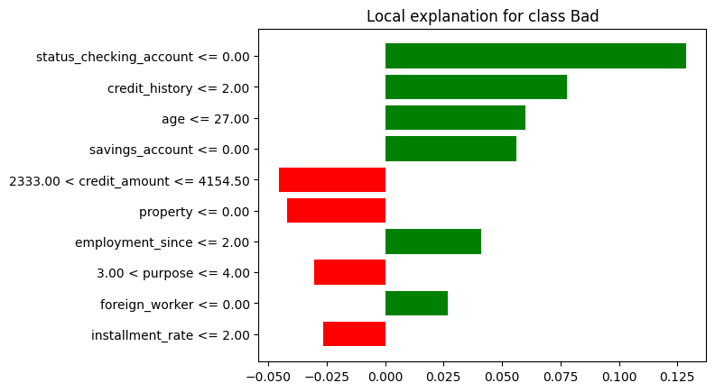

# 🧠 Decifrando a Caixa Preta: Tornando Modelos de IA Explicáveis com LIME

Este projeto aplica técnicas de *Explainable Artificial Intelligence (XAI)* no contexto de concessão de crédito bancário. A partir de um modelo preditivo treinado com o **German Credit Data**, utilizamos a biblioteca [LIME](https://github.com/marcotcr/lime) para gerar explicações locais sobre as decisões do modelo para cada cliente.

---

## 🎯 Objetivo

- Criar um modelo de machine learning para classificar clientes como **bom** ou **mau risco de crédito**.
- Aplicar a técnica **LIME** para gerar explicações individuais, claras e interpretáveis para decisões de concessão ou negação de crédito.
- Atender às necessidades de **clientes, gerentes e órgãos regulatórios**, promovendo transparência e confiabilidade.

---

## 📊 Dataset: German Credit Data

- **Fonte:** [UCI Machine Learning Repository](https://archive.ics.uci.edu/ml/datasets/statlog+(german+credit+data))
- **Registros:** 1000 clientes
- **Atributos:** 20 (como idade, status da conta, histórico de crédito, renda, emprego, etc.)
- **Alvo:**  
  - 1 = Bom pagador  
  - 2 = Mau pagador

> Usamos o arquivo `german.data` (versão original), realizando o pré-processamento com `LabelEncoder`.

---

## ⚙️ Tecnologias Utilizadas

- Python 3
- pandas, numpy, matplotlib
- scikit-learn (modelo Random Forest)
- LIME (Local Interpretable Model-Agnostic Explanations)

---

## 🧠 Modelo Preditivo

- **Tipo:** Classificação binária
- **Modelo escolhido:** `RandomForestClassifier`
- **Motivos:**
  - Alta acurácia
  - Robustez a dados ruidosos
  - Compatível com interpretabilidade via LIME

---

## 🔎 Etapas do Projeto

1. Carregamento e nomeação das colunas do dataset
2. Codificação dos atributos categóricos com `LabelEncoder`
3. Separação treino/teste com `train_test_split`
4. Treinamento de um modelo de floresta aleatória
5. Avaliação com `classification_report`
6. Aplicação do LIME em uma predição individual
7. Geração de gráficos e arquivos explicativos (`.png`, `.html`)

---

## 📈 Exemplo de Explicação com LIME

Abaixo está um gráfico real gerado pelo projeto, indicando os fatores que influenciaram a decisão do modelo para um cliente específico.



---

## ▶️ Como Executar o Projeto

1. Clone este repositório:
```bash
git clone https://github.com/seu-usuario/german-credit-xai-lime.git
cd german-credit-xai-lime


